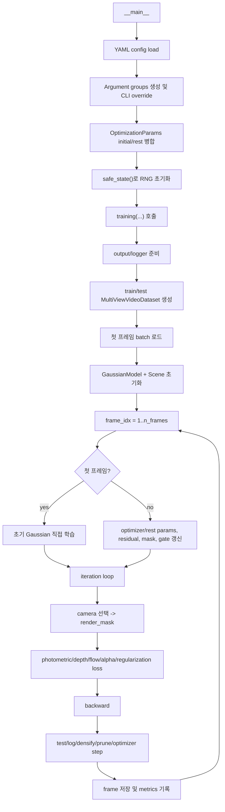

# `train.py` 코드 따라가기

이 문서는 `train.py`를 처음 읽을 때 어디서 시작하고, 어떤 변수와 호출을 따라가면 전체 학습 흐름이 보이는지 정리한 가이드입니다.

## 한 줄 요약

`train.py`는 동적 multi-view 비디오를 프레임 단위로 처리한다. 첫 프레임에서는 COLMAP/데이터셋 point cloud로 Gaussian을 초기화해 충분히 학습하고, 이후 프레임에서는 이전 프레임의 Gaussian을 기준으로 residual/quantization, update mask, gate, selective training을 적용해 변화한 부분 위주로 갱신한다.

## 먼저 볼 파일

| 파일 | 확인할 내용 |
| --- | --- |
| `train.py` | 학습의 전체 orchestration. argument parsing, frame loop, iteration loop, loss, logging, save가 모두 여기 있다. |
| `arguments/__init__.py` | `ModelParams`, `OptimizationParamsInitial`, `OptimizationParamsRest`, `QuantizeParams`의 기본값과 YAML/CLI merge 방식. |
| `utils/loader_utils.py` | `MultiViewVideoDataset`, `SequentialMultiviewSampler`. 한 프레임의 모든 카메라 이미지를 한 batch로 묶는 구조. |
| `scene/__init__.py` | `Scene` 초기화, 데이터셋 타입 판별, camera 생성, point cloud 기반 Gaussian 초기화. |
| `scene/gaussian_model.py` | optimizer setup, residual/latent decoder, mask/freeze, densification, compressed pkl 저장. |
| `gaussian_renderer/__init__.py` | `render`, `render_mask`, `render_mask_shift`가 실제 image/depth/flow/alpha를 rasterize한다. |

## 전체 실행 흐름



## 1. Entry point부터 읽기

시작점은 `train.py`의 `if __name__ == "__main__":` 블록이다.

읽는 순서:

1. `--config`가 있으면 YAML을 먼저 읽는다.
2. `ModelParams`, `OptimizationParamsInitial`, `OptimizationParamsRest`, `PipelineParams`, `QuantizeParams`를 parser에 등록한다.
3. CLI argument가 YAML 기본값을 override한다.
4. `--scene`을 쓰면 `data_root/scene`에서 `source_path`를 만들고, `model_path` 기본값을 잡는다.
5. `OptimizationParams(op_i, op_r)`가 frame 1용 initial params와 frame 2 이후 rest params를 하나의 객체로 묶는다.
6. `safe_state(args.quiet)`로 RNG/device 상태를 초기화한다.
7. `training(...)`을 호출한다.

이 블록을 볼 때는 `args`가 어떻게 만들어지는지에 집중하면 된다. 실제 학습 로직은 거의 전부 `training()` 안에 있다.

## 2. `training()` 초반: 데이터, 모델, Scene 준비

`training()` 초반부는 학습에 필요한 상태를 한 번 구성한다.

핵심 순서:

1. `prepare_output_and_logger(args)`가 `model_path`, `cfg_args`, TensorBoard, wandb를 준비한다.
2. `MultiViewVideoDataset`을 train/test split으로 만든다.
3. `SequentialMultiviewSampler`와 `DataLoader(batch_size=n_cams)`를 쓴다.
4. `next(train_loader)`가 첫 프레임의 모든 train camera 이미지를 반환한다.
5. `GaussianModel(dataset.sh_degree, qp, dataset, ...)`를 만든다.
6. `Scene(...)`이 camera metadata를 읽고, point cloud로 Gaussian을 초기화한다.
7. `gaussians.training_setup(opt)`가 Gaussian latent와 decoder parameter를 optimizer에 등록한다.

`utils/loader_utils.py`에서 중요한 점은 sampler가 frame-major 순서로 index를 만든다는 것이다.

```text
frame 0: cam0, cam1, cam2, ...
frame 1: cam0, cam1, cam2, ...
...
```

그래서 `batch_size=n_cams`일 때 `next(train_loader)`는 "한 시점의 모든 camera view"가 된다.

## 3. 첫 프레임과 이후 프레임은 다르게 동작한다

`training()`의 가장 큰 구조는 `for frame_idx in range(start_frame_idx, n_frames+1)`이다.

### 첫 프레임

첫 프레임에서는 `Scene` 초기화 때 만든 Gaussian을 바로 학습한다. 이후 프레임용 residual/gate/mask 갱신 블록은 `frame_idx > 1` 조건 때문에 건너뛴다.

주로 보는 변수:

| 변수 | 의미 |
| --- | --- |
| `train_cameras` | 현재 프레임의 train camera 목록 |
| `cur_frame_views` | 현재 프레임의 모든 train 이미지 |
| `opt.iterations` | 첫 프레임은 `opt.epochs * n_cams` |
| `gaussians` | 현재 학습 중인 Gaussian state |

### 이후 프레임

`frame_idx > 1`이면 학습 iteration loop에 들어가기 전에 다음 작업을 한다.

1. `opt.set_params(frame_idx)`로 rest hyperparameter로 전환한다.
2. `opt.iterations = frame_iters[frame_idx-1]`로 현재 프레임 iteration 수를 정한다.
3. `gaussians.frame_idx = frame_idx`를 설정한다.
4. `gaussians.update_residuals()`가 이전 frame 기준 residual latent/decoder를 준비한다.
5. `gaussians.training_setup(opt)`로 optimizer를 새로 만든다.
6. `scene.updateCameraImages(...)`가 camera object의 image/path/frame index를 현재 프레임으로 교체한다.
7. `dataset.update_mask`에 따라 변화 영역을 계산한다.
8. `gaussians.update_masks(...)`, `gaussians.freeze_atts(...)`로 학습할 Gaussian attribute를 제한한다.
9. gate를 쓰는 설정이면 `Gate`를 만들거나 reset한다.
10. `dataset.flow_update`가 켜져 있으면 `gaussians.update_points_flow()`로 point 위치를 flow에 맞춰 갱신한다.

## 4. Update mask 읽는 법

이 코드의 dynamic update 핵심은 "어떤 Gaussian을 이번 프레임에서 업데이트할 것인가"이다.

주요 모드:

| `dataset.update_mask` | 동작 |
| --- | --- |
| `"diff"` | 이전/현재 GT image 차이에서 pixel mask를 만들고, `render_mask(..., pixel_mask=...)`의 influence로 Gaussian mask를 역투영한다. |
| `"viewspace_diff"` | 현재 render가 이전/현재 GT에 대해 만드는 loss 차이의 gradient를 viewspace point 기준으로 누적해 Gaussian mask를 만든다. |
| `"none"` | dynamic mask 없이 전체 또는 freeze 설정에 따른 attribute를 학습한다. |

`adaptive_render`와 `adaptive_update_period`가 켜져 있으면 camera별 `camera.mask`, `camera.orig_mask`도 저장되고, iteration loop에서 `pixel_mask`로 selective photometric loss에 들어간다.

## 5. Iteration loop 읽는 법

프레임별 준비가 끝나면 `for iteration in range(first_iter, opt.iterations + 1)`가 돈다.

한 iteration의 순서는 다음과 같다.

1. 이후 프레임이면 quantization 전환과 freeze schedule을 처리한다.
2. `gaussians.update_learning_rate(iteration, qp)`로 LR을 갱신한다.
3. 1000 iteration마다 SH degree를 올린다.
4. train camera 하나를 랜덤하게 선택한다.
5. GT image에 resize/blur/downsample transform을 적용한다.
6. `render_mask(...)`로 현재 Gaussian을 rendering한다.
7. reconstruction, alpha, regularization, flow, depth, temporal consistency loss를 더한다.
8. `loss.backward()`를 호출한다.
9. `training_report(...)`로 test/val render와 logging을 수행한다.
10. densification/pruning 통계를 쌓고 필요하면 point를 추가/제거한다.
11. 마지막 부분에서 sample render, depth/error image, spiral image, ply/pkl 등을 저장한다.
12. `gaussians.optimizer.step()`과 gate optimizer step을 수행한다.

가장 먼저 이해해야 하는 call은 `render_mask(...)`다. 이 함수의 반환값 중 `render`, `viewspace_points`, `visibility_filter`, `radii`, `alpha`, `depth`, `flow`, `influence`가 loss와 densification/pruning에 계속 쓰인다.

## 6. Loss 구성

기본 photometric loss:

```text
(1 - lambda_dssim) * L1 + lambda_dssim * (1 - SSIM)
```

추가 loss:

| 조건 | loss |
| --- | --- |
| `opt.lambda_alpha > 0` | rendered alpha와 GT alpha mask의 L1 |
| `opt.weight_decay > 0` | latent decoder std regularization |
| `gaussians.gate_atts.training` | gate regularization |
| `opt.lambda_posres > 0` | 이전 xyz 대비 residual 크기 제약 |
| `opt.lambda_flow > 0` | next frame consistency. `render` 방식 또는 optical flow `warp` 방식 |
| `opt.lambda_depth > 0 and frame_idx == 1` | MiDaS depth 기반 relative depth supervision |
| `opt.lambda_consistency > 0` | 이전 render와 현재 render의 temporal consistency |

## 7. Densification, pruning, 저장

첫 프레임과 이후 프레임의 densification이 다르다.

| 프레임 | 메서드 | 의도 |
| --- | --- | --- |
| 첫 프레임 | `gaussians.densify_and_prune(...)` | 일반 3DGS처럼 gradient 기반 clone/split 후 opacity/size 기준 prune |
| 이후 프레임 | `gaussians.densify_dynamic(...)` | 새로 추가된 dynamic point 위주로 관리하고 이전 프레임 mapping을 유지 |

프레임 iteration loop가 끝난 뒤에는 다음을 저장한다.

| 조건 | 저장 |
| --- | --- |
| `-1 in saving_iterations` and `save_format == "ply"` | `scene.save(opt.iterations)` |
| `dataset.log_compressed` and `frame_idx == 1` | 첫 프레임 point cloud 저장 |
| `dataset.log_compressed` and `frame_idx > 1` | `scene.save_compressed(-1, qp)`로 compressed pkl 저장 |
| 항상 | `training_metrics.json`, `stage_times.json`, `avg_metrics.json`는 전체 종료 후 저장 |

## 8. 프레임 사이 상태 전달

각 프레임이 끝나면 다음 프레임의 residual encoding을 위해 이전 상태를 고정해서 보관한다.

핵심 변수:

| 변수 | 역할 |
| --- | --- |
| `gaussians.prev_atts` | 이전 프레임의 decoded Gaussian attributes |
| `gaussians.prev_latents` | 이전 프레임의 latent attributes |
| `gaussians.prev_atts_initial` | residual 기준으로 보관하는 초기 previous attribute |
| `cur_frame_views` | 다음 loop에서 현재 프레임 이미지가 됨 |
| `prev_xyz` | position residual regularization 기준 |

이 부분을 이해하면 `update_residuals()`가 왜 다음 프레임 시작 시 zero residual latent를 새로 만들 수 있는지 보인다.

## 9. 코드 읽기 추천 순서

1. `train.py`의 `__main__` 블록에서 config/argument가 어떻게 만들어지는지 확인한다.
2. `arguments/__init__.py`에서 `ModelParams`, `OptimizationParamsInitial`, `OptimizationParamsRest`, `QuantizeParams` 기본값을 훑는다.
3. `utils/loader_utils.py`에서 batch 하나가 "한 프레임의 모든 카메라"라는 점을 확인한다.
4. `scene/__init__.py`에서 dataset type 판별과 `gaussians.create_from_pcd(...)` 초기화를 본다.
5. `train.py`의 `training()` 초반에서 첫 프레임 로드, `GaussianModel`, `Scene`, `training_setup`까지 따라간다.
6. `for frame_idx ...`의 `frame_idx > 1` 블록을 읽고 residual/mask/freeze/gate 갱신을 이해한다.
7. `for iteration ...` 안에서 `render_mask -> loss -> backward -> report -> densify/prune -> optimizer.step` 순서로 읽는다.
8. `training_report()`에서 test/val render, image 저장, PSNR/L1 logging 방식을 확인한다.
9. `scene/gaussian_model.py`의 `training_setup`, `update_residuals`, `update_masks`, `freeze_atts`, `densify_dynamic`, `save_compressed_pkl`만 골라 읽는다.

## 10. 디버깅할 때 찍어보면 좋은 값

| 위치 | 값 |
| --- | --- |
| `training()` 데이터 로드 직후 | `train_images.shape`, `train_image_dataset.n_frames`, `train_image_dataset.n_cams` |
| Scene 생성 직후 | `gaussians.get_xyz.shape`, `len(train_cameras)`, `scene.dataset_type` |
| frame loop 시작 | `frame_idx`, `opt.iterations`, `scene.model_path` |
| mask 계산 직후 | `torch.count_nonzero(gaussians.mask_xyz)`, `dataset.update_mask` |
| render 직후 | `image.shape`, `visibility_filter.sum()`, `radii.max()` |
| loss 직후 | `Ll1.item()`, `loss.item()` |
| densification 후 | `gaussians._xyz.shape[0]` |
| 저장 직후 | `cur_size`, `metrics["val"]["psnr"]`, `metrics["test"]["psnr"]` |

## 11. 헷갈리기 쉬운 지점

- `testing_iterations`, `checkpoint_iterations`, `checkpoint`, `debug_from`는 signature에 있지만 현재 흐름에서 핵심적으로 쓰이지 않거나 제한적으로만 쓰인다.
- `opt.iterations`는 config의 고정값이 아니라 `epochs * n_cams` 또는 frame별 adaptive iteration으로 다시 설정된다.
- `train_loader`는 이미 첫 프레임을 한 번 소비한다. frame loop 안의 `next_train_data = next(train_loader)`는 현재 프레임 학습 중 flow loss와 다음 프레임 전환을 위해 미리 읽는 값이다.
- `Scene`은 프레임마다 새로 만들지 않는다. camera object의 image만 `scene.updateCameraImages(...)`로 교체한다.
- 첫 프레임 depth supervision은 `frame_idx == 1` 조건이 붙어 있다.
- compressed 저장은 PLY 저장과 별개로 `dataset.log_compressed` 조건에서 처리된다.
